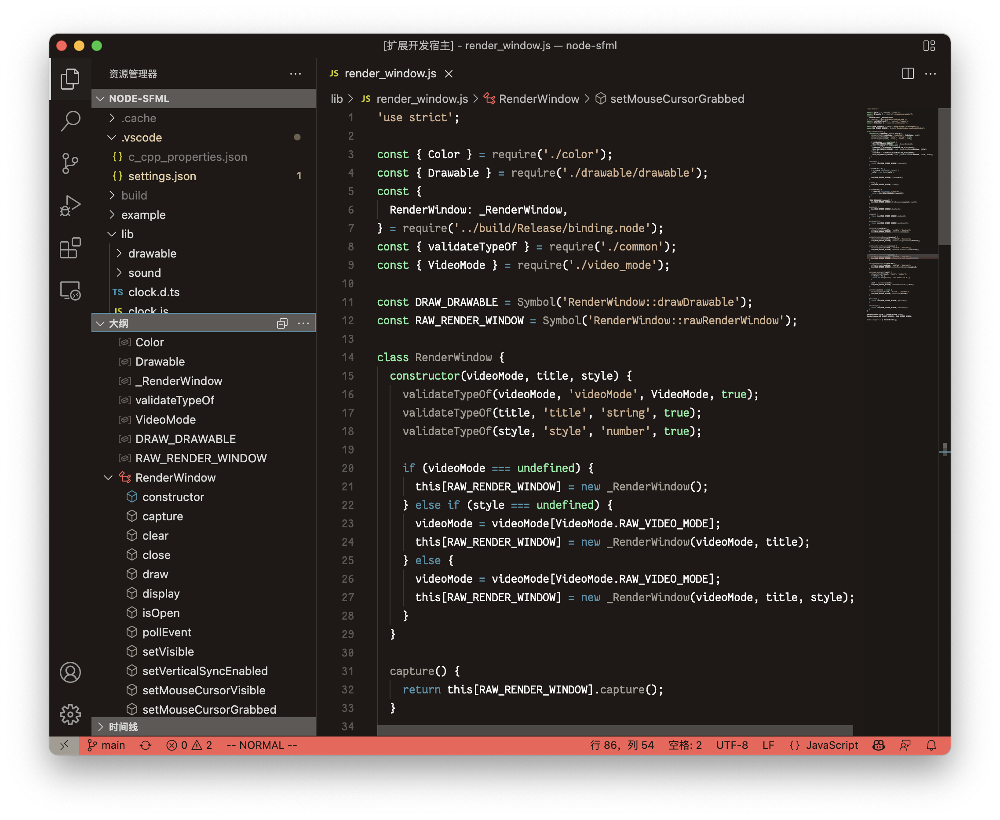
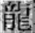
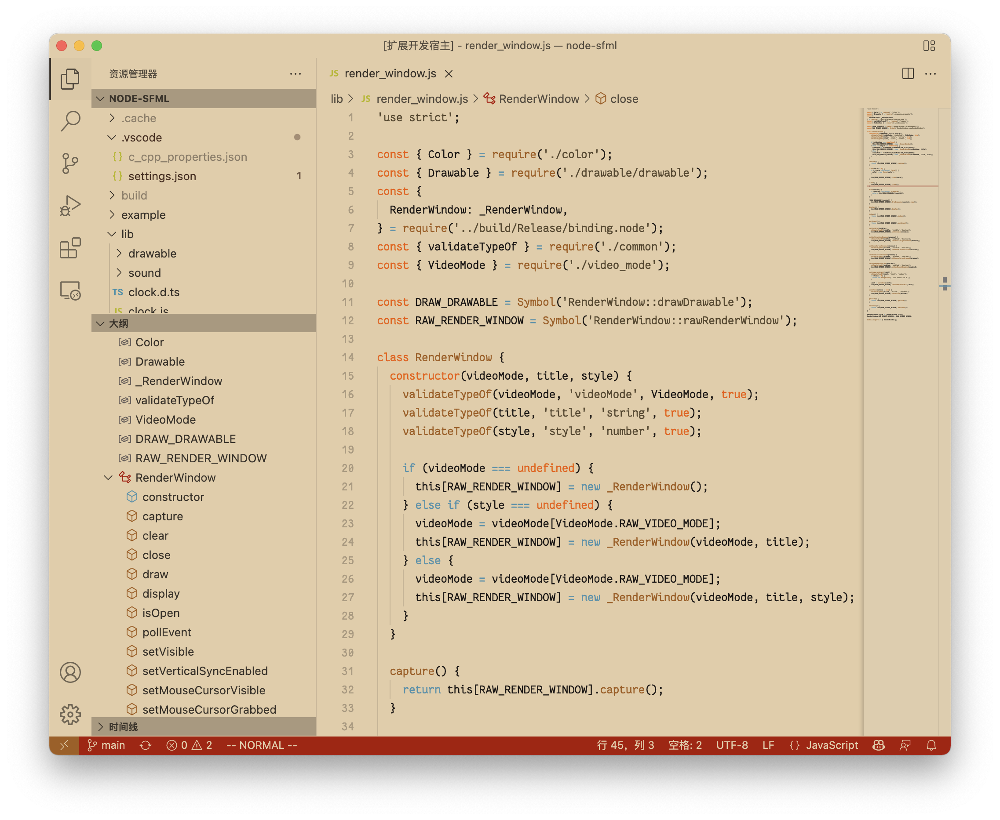
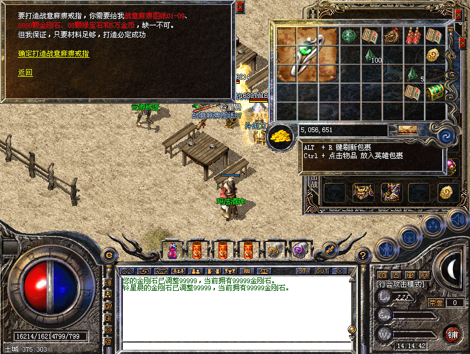

# Mir2 Theme

[*Legend of Mir2*](https://en.wikipedia.org/wiki/The_Legend_of_Mir_2) theme for Visual Studio Code.

## Palette

The palette was extracted from the original picture below by [Theme Color Extracting Service](https://theme-color.herokuapp.com/).

<table border="0">
  <thead>
  <tr>
    <td align="center"><b>Dark</b></td>
    <td></td>
    <td align="center"><b>Light</b></td>
  </tr>
  </thead>
  <tbody>
  <tr>
    <td> </td>
    <td width="8%"></td>
    <td> </td>
  </tr>
  <tr>
  <td colspan="3" align="center">
    <b>Original Picture</b> 
  </td>
  </tr>
  </tbody>
</table>

## Projects / Services Used

- [thmclrx](https://github.com/xadillax/thmclrx);
- [Theme Color Extract Service](https://github.com/XadillaX/theme-color-extract-service) deployed on [Heroku](https://theme-color.herokuapp.com/);
- [themer](https://themer.dev/?activeColorSet=dark&colors.light.shade0=%23e0cdab&colors.light.shade7=%231c1815&colors.light.accent1=%23655d59&colors.light.accent0=%23b09872&colors.light.accent7=%23de640d&colors.light.accent5=%239d1308&colors.light.accent6=%235e91a9&colors.light.accent4=%239a602a&colors.light.accent3=%23564932&colors.light.accent2=%23473023&colors.dark.shade0=%231d1916&colors.dark.shade7=%23fafaf9&colors.dark.accent0=%23b09872&colors.dark.accent1=%23655d59&colors.dark.accent2=%23e0cdab&colors.dark.accent3=%23cdb294&colors.dark.accent4=%23a29d94&colors.dark.accent5=%23e5685d&colors.dark.accent6=%235e91a9&colors.dark.accent7=%239cebaa&calculateIntermediaryShades.light=true).

## Contribution

Issues and PRs are welcomed.
